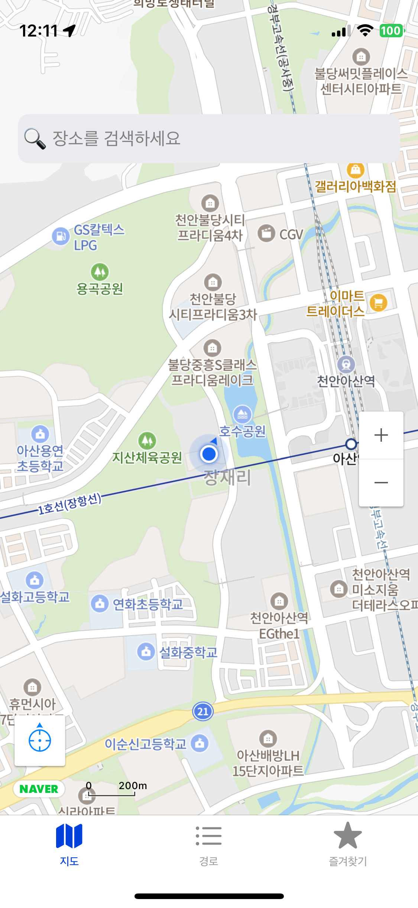
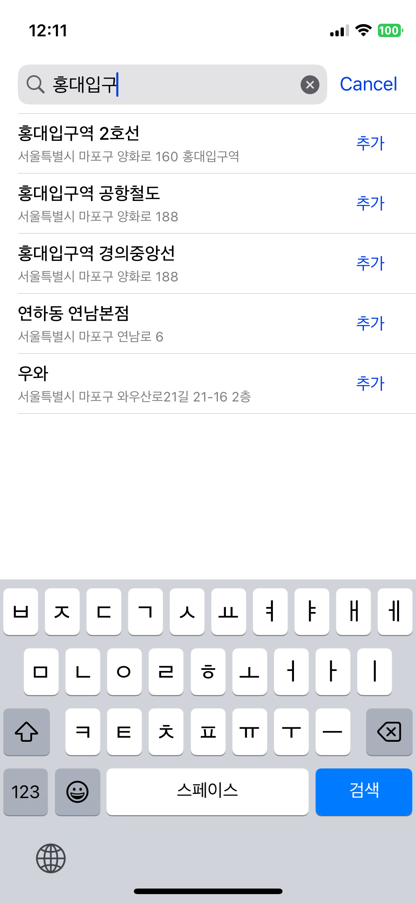
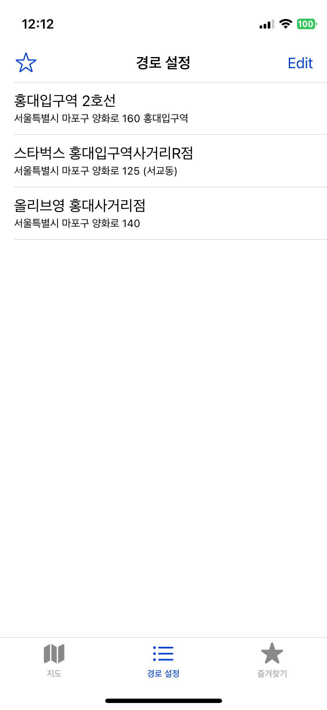

# 🗺️ AppTitle - 지도 기반 경로 설정 앱

도보로 이동을 많이 하시는 분들을 위해 제작된 앱입니다.
원하는 장소를 검색하고, 나만의 경로를 만들고, 자주 찾는 경로를 즐겨찾기로 저장할 수 있습니다.

---

## 📌 기능 소개

### ✅ 지도 기능

- 검색창 클릭 시 장소 검색 화면으로 이동
- 현재 위치 버튼을 통해 내 위치 기준 지도를 불러오기
- 확대 / 축소 버튼으로 지도 조절 가능

---

### 🔍 장소 검색

- 검색창을 통해 원하는 장소를 검색
- 검색 결과에는 점포명과 상세주소가 리스트로 표시됨
- "추가" 버튼을 누르면 해당 장소가 경로설정 탭에 등록됨

---

### 🧭 경로 설정

- 검색을 통해 추가된 장소들이 리스트 형태로 표시됨
- ✏️ 편집 기능을 통해 다음이 가능함:
    - 장소 순서 변경
    - 개별 삭제
    - 전체 초기화
- ⭐ 즐겨찾기 버튼을 눌러 현재 설정된 경로를 저장 가능

---

### ⭐ 즐겨찾기 관리

- 즐겨찾기 탭에 저장된 경로 목록이 표시됨
- ✏️ 편집 기능을 통해 즐겨찾기 항목도 다음과 같이 조정 가능:
    - 항목 순서 변경
    - 삭제
    - 초기화
---
